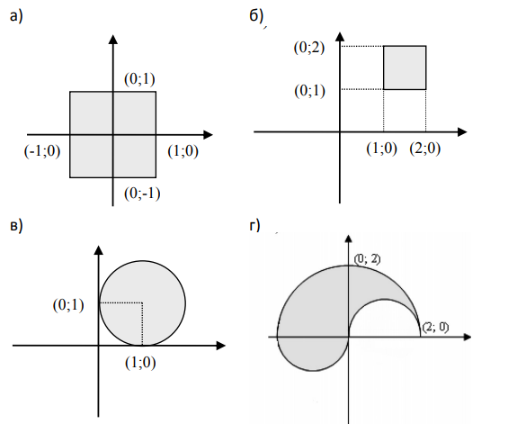
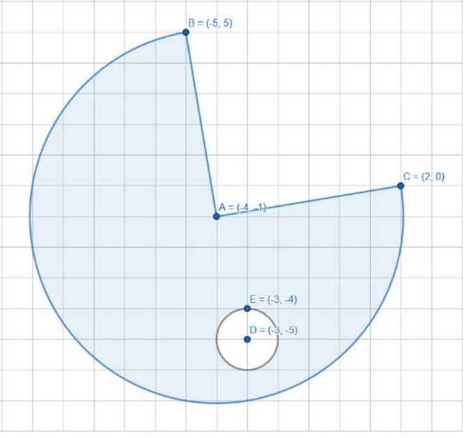
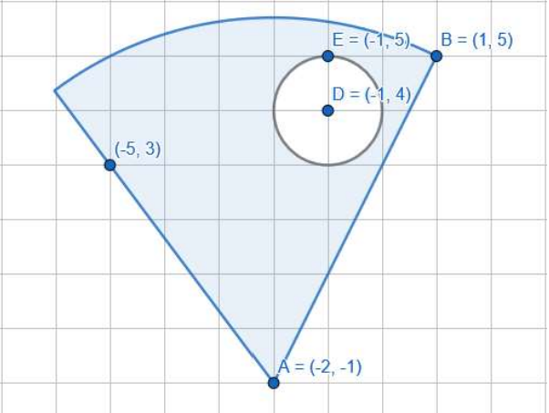

### Тази седмица фокусът на нашето занятие ще бъде върху решаването на задачи
> Задачите са предвидени и могат да се решат без конструкции - if / else / switch for / while / do while
---

### Задача 0
Какъв ще бъде изходът на следната програма: 
~~~
#include <stdio.h>

int main()
{
    int age;
    char initial;
    scanf("%d", &age);
    scanf(" %c", &initial);
    
    printf("%d\n", age);
    printf("%c", initial);
    return 0;
}
~~~

<details><summary><b>Отговор</b></summary> 
<p>

```c
// вторият scanf() прочита остатъчния '\n' символ от въвеждането на числото
#include <stdio.h>

int main()
{
    int age;
    char initial;
    scanf("%d", &age);
    // Поставяйки интервал пред %c караме scanf() да пропусне whitespace символи (space/tab/newline)
    scanf(" %c", &initial);
    
    printf("%d\n", age);
    printf("%c", initial);
    return 0;
}
```
</p>
</details>

### Задача 1
Да се напише програма, която въвежда координатите на точка и
проверява дали тя се съдържа във фигурата:  



### Задача 2 (КР/2024)  
Напишете логически израз, който се оценява като истина, ако точка с
координати (x, y) принадлежи на оцветената област, и като лъжа в
противен случай. 



### Задача 3 (КР/2024)
Напишете логически израз, който се оценява като истина, ако точка с
координати (x, y) принадлежи на оцветената област, и като лъжа в
противен случай. 



### Задача 4
Дадени са ви две валидни точки от шахматна дъска (x1,y1), (x2,y2). Проверете дали може да се достигне от първата до втората точка с един ход на:  
а) кон, цар или топ;  
б) царица, офицер;  
**За улеснение считайте, че дъската има клетки с координати, подобно на Декартова КС, като започвате да броите от (0,0)**  

~~~
#Пример
Вход:
0 0 1 2

Horse: 1
Bishop: 0
Tower: 0

Tower: 0
King: 0
Queen: 0
~~~

## Задача 5
Дадени са 4 цели числа A, B, C и D. Да се намери сумата на двата края на сечението на [A, B] и [C, D].  
(−1018 <= 𝐴 <= 𝐵  𝐶 <= 𝐷 <= 1018)

~~~
#Примери

Вход  
2 8  
-7 5  
Изход  
7 --> [2,8] ^ [-7,5] = [2,5] 
Вход  
0 18  
22 22  
Изход  
0
Вход  
1 8  
2 7
Изход  
9 --> [2,7]
~~~

## Задача 6
Дадена е декартова координатна система. Всеки правоъгълник със страни успоредни на координатните оси в нея може да се определи с четири числа с плаваща точка: координатите на долния си ляв ъгъл (x, y), ширината и дължината си. Напише програма, която прочита от стандартния вход данни за два правоъгълника и извежда на екрана дали се пресичат

~~~
#1 Пример
Вход:
0 0 5 3
4 1 3 3

Изход:
1

#2 Пример
Вход:
0 0 2 2
-1 -1 1 1

Изход:
0
~~~

## Задача 7 --> Продължение на задача 5 (ДР/2023)
Изведете лицето на частта, в която двата правоъгълника се пресичат и 0 ако не се.

~~~
#1 Пример
Вход:
0 0 5 3
4 1 3 3

Изход:
2

#2 Пример
Вход:
0 0 2 2
-1 -1 1 1

Изход:
0
~~~

## Задача 8  
Да се напише програма, която прочита от стандартния вход радиус на окръжност r, с център (0,0) и точка - px, py. Определете дали точката се намира вътре, върху или извън окръжността.  

~~~
#1 Пример
Вход:
5 5
10

Изход:
Inside:      1
On border:   0
Outside:     0

#2 Пример
Вход:
5 2
4

Изход:
Inside:      0
On border:   0
Outside:     1

#3 Пример
Вход:
1 1
1.414214

Изход:
Inside:      1
On border:   0
Outside:     0
~~~

## Задача 9
Прочетете от конзолата:  
  - Окръжност, представена като (**radius**, **xCenter**, **yCenter**)  
  - Правоъгълник, успореден на координатните оси, представен като (x1, y1, x2, y2).Където (x1, y1) са                  координатите на долния ляв ъгъл, а (x2, y2) — на горния десен ъгъл.  
Изведете на конзолата дали окръжността и правоъгълника се пресичат!
~~~
#Пример 1
Вход:
Insert Circle params (radius, x, y): 1 0 0
Insert rectangle params (point 1, point2): 1 -1 3 1
Output: true
Обяснение: Кръгът и правоъгълника споделят точка (1,0).

#Пример 2
Вход:
Insert Circle params (radius, x, y): 1 1 1
Insert rectangle params (point 1, point2): 1 -3 2 -1
Output: false
~~~

## Задача 10  
Напишете програма, която въвежда време от денонощието във формат HH:MM:SS и извежда в същия формат
времето, което е 1 секунда след въведеното.

~~~
#Примери:  

Вход  
12:45:56  
Изход  
12:45:57  

Вход   
13:57:59  
Изход  
13:58:00  
~~~


